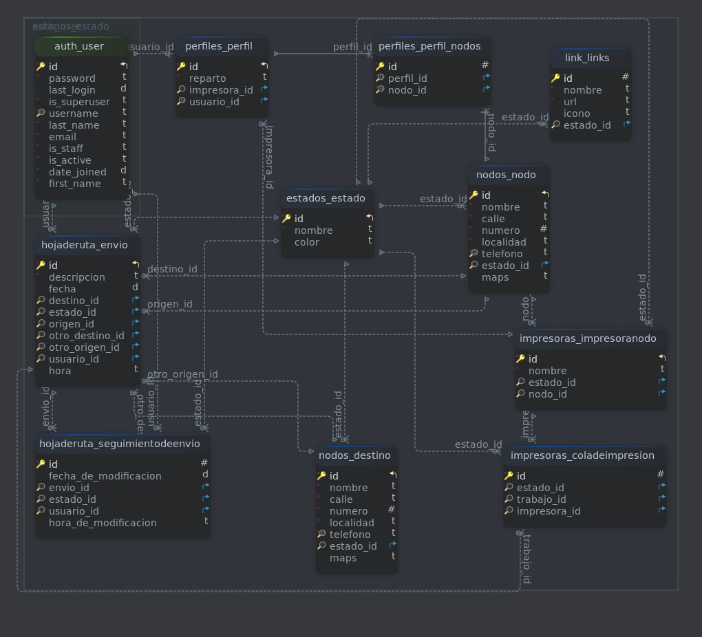

# PROYECTO DJANGO
## Descripción del proyecto

El proyecto consiste en un sitio para envíos desde una sucursal (nodo) a otra dentro de una cadena de farmacias. Con la posibilidad de crear nuevos destinos diferentes a las sucursales en caso de ser necesario. 

Dentro de cada envío se detalla el usuario de creación, fecha, hora, estado y la descripción. Cada envío tiene un seguimiento; este detalla también al usuario que lo modificó y su nuevo estado con fecha y hora. El fin de este seguimiento es para tener un control de cada envío para saber su estado actual y si llegó a su destino correcto.
### Estados

Actualmente, los envíos cuentan con 4 estados:

* PREPARADO: Indica el nivel inicial de un envío, es decir, se creó un envío y está en la sucursal de origen.

* IGNORADO: Este es el caso de un envío creado por error o por x motivo no debe ser enviado. Solo puede tomar este estado por su usuario de creación.

* EN CAMINO: El envío debe tomar este estado cuando el repartidor lo retira de su sucursal de origen. Y está listo para ser entregado a la sucursal destino o al destino nuevo que creó el usuario de envío (ejemplo: un envío a una ferretería, la cual es ajena a la organización).

* ENTREGADO: Por último, este es el estado que le da un cierre al envío, solo puede tomar dicho estado por un usuario correspondiente a la sucursal de destino. En el caso de ser un envío con destino diferente, es el repartidor quien puede hacer esta modificación.

Los estados no solo sirven para envíos, sino que también para habilitar/deshabilitar nodos/destinos por el usuario administrador. La función de crear nuevos estados es para definir situaciones que se presenten a futuro con respecto a envíos, nodos, links de accesos. Uno de los objetivos principales de los estados es no eliminar información dentro de la base de datos, sino actualizar su situación.
### Login y perfil del usuario

El proyecto actualmente cuenta con "registration-redux" para la creación de usuarios y una sección de perfil para que el usuario complete indicando a la o las sucursales a las que pertenece. Vale mencionar que un usuario puede pertenecer solo a una sucursal o a varias, lo que le da acceso a enviar desde todos sus nodos y recibir envíos con destinos a esos nodos. En producción, la sección de perfil solo va a ser administrada por un usuario con privilegios. Este mismo será quien defina la o las sucursales en las que pueden operar los usuarios.   

## Sitio 
### Página Principal

Esta sección del sitio ofrece información al usuario logueado de sus envíos, los que tiene para recibir y los envíos que serán enviados a destinos fuera de la organización, todos estos datos son presentados en forma de tabla con la posibilidad de acceder a un detalle más exacto de cada envío, este muestra más información sobre el envío y los cambios de estados que afectaron dicho envío, también muestra un código QR del ID del envío, esta será útil para que el usuario repartidor para reconocer rápidamente el envío a la hora de recibirlo y actualizar su estado a "EN CAMINO", y para el usuario receptor a la hora de recepcionar y cambiar su estado a "RECIBIDO".

Dentro de la sección *MIS ENVÍOS* y *OTROS DESTINOS* está el link para acceder al formulario para crear en envíos. En los dos casos, este formulario solo dará la opción para crear los envíos con origen relacionado a  nodos (sucursales) habilitados que tenga el usuario logueado. La fecha y hora de creación no serán un campo a completar, ya que la base de datos tomaría por defecto la actual. Solo deberá completar el destino (nodo de la organización) al cual quieran relacionar su envío y una descripción de lo que se está enviando.

La diferencia con la sección para "otros destinos" es que el formulario ofrecerá una lista de destinos por fuera de la organización habilitados para los usuarios. De no existir dicho destino, el usuario deberá acceder a *DESTINOS* y crearlo. 

### Sección de NODOS y DESTINOS 

Estas dos secciones ofrecen información de los orígenes/destinos habilitados, como la dirección, teléfono y localidad de los mismos, y también un enlace para ver su ubicación dentro de mapas de Google. Dicha información es útil para que el usuario repartidor sepa dónde retirar y/o entregar los pedidos. El caso de los nodos (sucursales de la cadena) son ingresados por el administrador. En el caso de los destinos, pueden ser creados por el usuario para casos en que los envíos sean para fuera de la organización.

### Sección QR

Aún no realizada, se proyecta utilizar la cámara para escanear el QR de los envíos y acceder de forma rápida a ellos.

### Sección Footer

Dentro del sitio se puede ver el footer, el cual contiene links de acceso a páginas externas al sitio que la organización considere útiles. Estos links deben ser creados desde el panel 'admin', para que el usuario los pueda ver.

## Base de datos



A continuación se detallan las tablas y su relación.

* Tabla Estado (declarada dentro de app estado): Detalla la situación actual. 

    - id: Identificador único. (int)

    - nombre: Nombre de estado. (str)

    - color: color opcional para identificarlo, ingresar código hexadecimal (str)

* Tabla Nodo (declarada dentro de app Nodos): Representa puntos de origen y destino dentro de un envío.

    -id: Identificador único. (int)

    -nombre: Nombre de sucursal. (str)
    
    -calle: Dirección - calle. (str)

    -numero: Dirección - número. (int)

    -localidad: Dirección - localidad (str)
    
    -teléfono: No permite valores repetidos, cuenta con un validador de números. (str) 

    -maps: Cadena de texto que representa la ubicación dentro de Google Maps (str)

    -estado: Clave foránea relacionada con tabla Estado.

* Tabla Destino (declarada dentro de app nodos): Representa puntos de origen y destino dentro de un envío fuera de la organización.

    -id: Identificador único. (int)

    -nombre: Nombre de sucursal. (str)
    
    -calle: Dirección - calle. (str)

    -numero: Dirección - numero. (int)

    -localidad: Dirección - localidad (str)
    
    -teléfono: No permite valores repetidos, cuenta con un validador de números. (str) 

    -maps: Cadena de texto que representa la ubicación dentro de Google Maps (str)

    -estado: Clave foránea relacionada con tabla Estado.

*  Tabla Envío (declarada dentro de la app hojaderuta): Donde se crean todos los envíos.
    
    - id: Identificador único. (int)    

    - usuario: Clave foránea relacionada con la clase User de Django. Esta representa al usuario creador.
    
    - origen: Clave foránea relacionada con la tabla Nodos. Esta representa el origen de un envío.

    - otro_origen: Clave foránea relacionada con la tabla Destinos. Esta representa a un envío con origen exento de organización (actualmente en desuso). 

    - estado: Clave foránea con tabla Estado. Representa la situación actual de dicho envío.
   
    - destino: Clave foránea con tabla Nodos. Representa el destino del envío.
    
    - otro_destino: Clave foránea relacionada con la tabla Destinos. Esta representa a un envío con destino exento a la organización. 
    
    - descripcion: Detalle de lo que se envía de clase TextField.(str)
    
    - fecha: Fecha de creación del envío. (date)
    
    - hora: Hora de creación del envío. (time) 

* Tabla SeguimientoDeEnvio (declarada dentro de la app hojaderuta): Detalla modificaciones dentro de un envío.
    
    - id: Identificador único. (int)    
   
    - usuario: Clave foránea relacionada con la clase User de Django. Esta representa al usuario que modifica.
    
    - envio: Clave foránea con tabla Envío.
    
    - estado: Clave foránea con tabla Estado. Representa estado de dicho envío.
    
    - fecha_de_modificacion: Fecha de modificación del envío. (date)
    
    - hora_de_modificacion: Hora de modificación del envío. (time)   

* Tabla Perfil (declarada dentro de la app perfiles): Indica los nodos (sucursales) a las cuales pertenecen los usuarios.
  
    - id: Identificador único. (int)  
    
    - usuario: Clave uno a uno relacionada con la clase User de Django. Solo puede existir un perfil por usuario.

    nodos: Clave muchos a muchos, relacionada con la clase Nodos.

    reparto: Indica si el usuario es repartidor (booleana).

    impresora: Clave foránea con clase InpresoraNodo.

* Tabla Links (declarada dentro de app link): Links de accesos para footer.

    - id: Identificador único. (int)  

    - nombre: Nombre a que lo identifica y a mostrar. (str)

    - url: URL del link al cual está asociado. (str)

    - icono: Imagen asociada al link.

    - estado: Clave foránea con tabla Estado. Representa estado del link (activo/inactivo).


> [!NOTE]
> Actualmente, la base de datos es la que Django ofrece por defecto (SQLite). En producción está planeado utilizar PostgreSQL, ya que es la base de datos con la que tengo más afinidad. 

## Objetivos

### Templatetags

Dentro del proyecto se utlizan 2 templatetags dentro de la aplicacion hojaderuta. El primero es para filtrar dentro de un una tabla los destinos del envio (si es un nodo de la organizacion o externo). Este permite reutilizar la tabla sin necesidad de crear una a media segun la ocacion.

```python
from django import template

register = template.Library()

@register.filter(name= 'ver_destino')
def ver_destino(envio):

    if envio.destino == None:

        return envio.otro_destino
    
    else:

        return envio.destino
```

De esta forma se utiliza dentro de el template pasandole como unico parametro "envio".

```html
<table class="table table-striped-columns table-sm">
    <thead class="table-dark">
        <tr>
        <th scope="col">ID</th>
        <th scope="col">Origen</th>
        <th scope="col">Destino</th>
        <th scope="col">Fecha</th>
        <th scope="col">Hora</th>
        <th scope="col">Estado</th>
        </tr>
    </thead>
    <tbody>
    
        
        

        <tr>                      
            <th style="color: rgb(94, 94, 94);" scope="row">
                <button type="button" class="btn btn-primary">
                    <a href="">{{ envio.id }}</a>
                </button>
            </th>
            <td style="color: rgb(94, 94, 94);">{{ envio.origen }}</td>
            <td style="color: rgb(94, 94, 94);">{{ envio|ver_destino }}</td> <!--Templatetag-->
            <td style="color: rgb(94, 94, 94);">{{ envio.fecha }}</td>
            <td style="color: rgb(94, 94, 94);">{{ envio.hora }}</td>
            <td style="color: rgb(94, 94, 94);">{{ envio.estado }}</td>
        </tr>   

        
    
    

    </tbody>
</table>

```

El segundo templatetag utilizado esta relacionado con formularios para hacer cambios de estado dentro de los envios, este toma dos parametros el envio y el perfil del usuario logueado, y retorna en formato html un select con la opcion que corresponda. Si el usuario no esta habilitado para modificar lo notificara.

```python

from django import template
from farmacia.models import Parametros
from django.utils.html import format_html

parametro = Parametros()

register = template.Library()
        
@register.filter(name= 'cambio_estado')
def cambio_estado(envio, perfil):

    if envio.origen in perfil:

        if envio.estado == parametro.preparado:

            return format_html(
                """
                    <select name="estado" class="form-select">
                        <option value="{}">{}</option>
                    </select>
                    
                    <input type="submit" value="OK" class="btn btn-primary btn-sm" id="btn_ok">
                
                """, parametro.ignorado.id, parametro.ignorado.nombre )
        
        else:
            
            return format_html('<p>No hay cambios de estados disponibles</p>')
    
    if envio.destino in perfil:

        if envio.estado == parametro.en_camino:

            return format_html( 
                """
                    <select name="estado" class="form-select">
                        <option value="{}">{}</option>
                    </select>
                    
                    <input type="submit" value="OK" class="btn btn-primary btn-sm" id="btn_ok">
                
                """, parametro.entregado.id, parametro.entregado.nombre )
        else:
            
            return format_html('<p>No hay cambios de estados disponibles</p>')

    else:
        return format_html('<p>No hay cambios de estados disponibles</p>')
```

Este templatetag se utiliza en el template hojaderuta/detalle_envio.html
```html
<h4>
    <b>Cambiar de estado</b>
</h4> 
<form method="post" action="">

    
            
    {{ envio|cambio_estado:nodos_perfil }}

    <input type="submit" value="OK" class="btn btn-primary btn-sm" id="btn_ok">

</form>
```