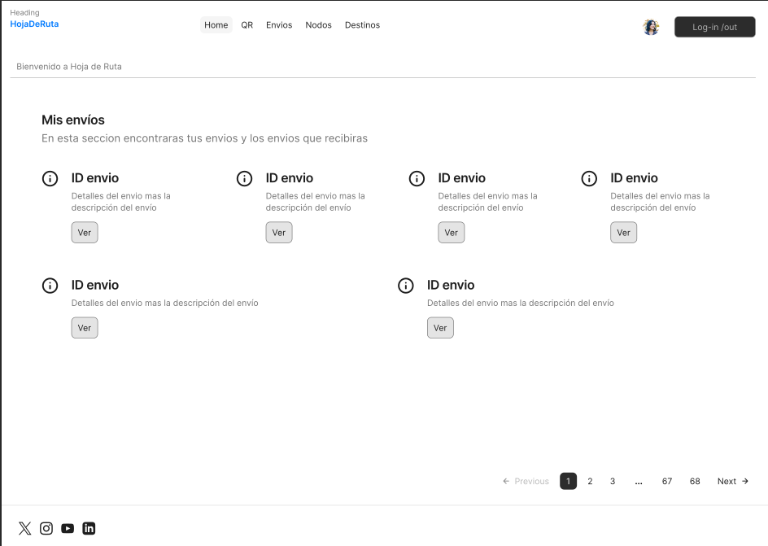
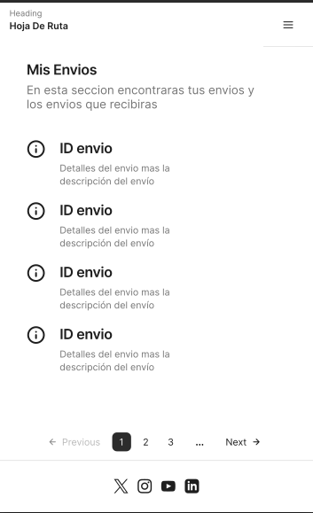

<h1>PROYECTO DJANGO</h1>

⁣<h3>Descripción del proyecto</h3>

El proyecto trata de un sitio de envíos y recepción de pedidos. Para que los usuarios carguen envíos desde un nodo al otro, los nodos son pre cargados por la empresa o el administrador, y cuenta con la posibilidad de que el usuario cree diferentes destinos para hacer sus envíos desde nodos a diferentes destinos o de diferentes destinos a los nodos de la empresa. 

Cada envío cuenta con los de detalles de preparación y  la posibilidad de detallar los movimientos a modo de histórico los cambios de estado que van surgiendo de dicho envío (ejemplo: si el envío es retirado por el repartidor se detalla que el estado del envío es EN CAMINO y cuando es recibido el estado del envío cambia a RECIBIDO). El proyecto cuenta también con la posibilidad de crear nuevos estados, los cuales son creados por el administrador con el fin de detallar nuevas posibilidades que sucedan con los envíos (ej:  el envío no se realizara por x motivo... entonces el estado cambiaria a IGNORADO) y o también para crear estados que describan la situación actual de los nodos, destinos e impresoras.

Sumado a los campos que por defecto trae Django para el registro de usuarios, se agrega el perfil de usuario, este declara si el usuario es repartidor o no y le asigna un nodo que le dará la posibilidad de ver los envíos asignados a ese nodo y no al resto, también así le asigna una impresora (esta parte es destinada a una API)

El usuario que contenga el perfil de reparto podrá ver los pedidos de todos los nodos y solo podrá cambiar de estado PREPARADO a EN CAMINO y el usuario que tenga asignado un nodo solo podrá crear pedidos desde su propio nodo y recibir pedidos referidos a su nodo (ej: cambiar el estado del pedido de EN CAMINO a RECIBIDO) o en el caso de ser quien lo creo podrá cancelar dicho envío.

El proyecto cuenta con un sector dedicado al servicio de impresión (esta parte es destinada a una API), se crean impresoras y se destinan a nodos, y cada envío creado desde la API se pone en una cola de impresión con su respectiva impresora.

Contiene un sector para crear links relacionados con la empresa, estos serán alojados  dentro del footer.

<h4>Boceto para escritorio</h4>

En la parte superior una barra de navegación que contiene de izquierda a derecha: 
    
1- El nombre del proyecto.

2- Los botones de navegación:

2.1- Home: lleva a la página principal del proyecto

2.2- Qr: Abre un lector de Qr, cada envío generará un qr el cual podrá ser leído por el lector.

2.3- Envíos: Dirige a un listado de envíos ordenados cronológicamente.

2.4- Nodos: Dirige a un listado de Nodos disponibles para realizar los envíos, contiene el detalle de cada nodo (dirección, teléfono, etc.).

2.5- Destinos: Al igual que los Nodos nos da un listado de los destinos disponibles, y un formulario para crear nuevos destinos.

3- Nombre o imagen de usuario logueado en el caso de que lo este, de lo contrario un enlace para registrarse.

4- Por último un botón de login - logout

Como cuerpo de la página principal, el listado de los envíos creados por el usuario logueado y  los envíos que recibirá dicho usuario dependiendo del nodo que tenga asignado. Dentro del listado cada envío mostrará sus detalles de preparación y llevará a un enlace único de donde podrá ver el qr asociado al envío y un campo para imprimirlo.

Por último un footer que contenga enlaces a diferentes páginas relacionadas con la empresa creados por el administrador, se mostrará a modo de icono/imagen.

<h4>Boceto para movil</h4>

Contiene los mismos ítems que el diseño de escritorio, con la diferencia de que los botones de la barra de navegación se agrupan dentro de un icono de menú.  
